# Лабораторная работа №5 - Отладка Python-проекта

## Ошибка 1 - сравнение `is` вместо `==`

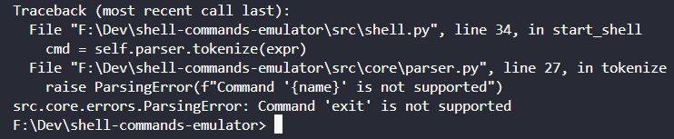

**Место:** `shell.py`, `start_shell`

**Симптом:**
Команда `exit` не завершает shell, появляется ошибка про неподдерживаемую команду.

**Воспроизведение:**

1. `uv run python main.py`, ввести `exit`.

**Отладка:**
Breakpoint на `if expr is "exit"`.
В отладчике: `expr == "exit"`, но `expr is "exit"`.

**Причина:**
`is` сравнивает объекты, а не значения, строка из `input()` - другой объект.

**Исправление:**
Заменено `is` на `==` (использован `expr.strip()`).

**Проверка:**
После исправления `exit` корректно завершает программу.

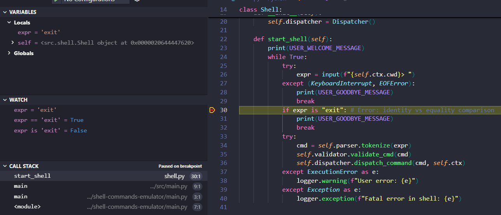

---

## Ошибка 2 - `Rm.undo` переносит не в ту сторону (аргументы перепутаны)

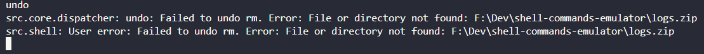

**Место:** `filesystem.py`, `Rm.undo`

**Симптом:**
После `rm` + `undo` файл не восстанавливается, падает с ошибкой (не находит файл/путь).

**Воспроизведение:**

1. `uv run python main.py`
2. `zip logs logs.zip`
3. `rm logs.zip` -> `Y`
4. `undo`

**Отладка:**
Breakpoint на строке с `positionals = [...]` в `Rm.undo`.
В отладчике видно `src` и `trash_path`, но `positionals` собраны как `src -> trash_path` (должно быть наоборот).

**Причина:**
Перепутан порядок аргументов: undo пытается сделать move из исходного пути в корзину, а надо из корзины обратно в исходный путь.

**Исправление:**
Поменял местами аргументы: `positionals = [trash_path, src]`.

**Проверка:**
После исправления `undo` восстанавливает `logs.zip` обратно.

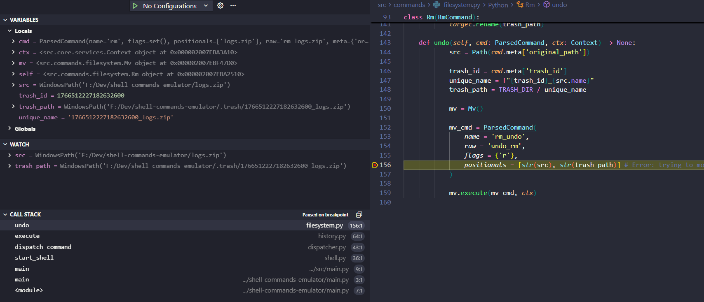

## Ошибка 3 - off-by-one в цикле (Undo пропускает первый элемент)

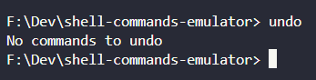

**Место:** `history.py`, `Undo.execute`

**Симптом:**
`undo` пишет `No commands to undo`, хотя последняя команда была `cp` и её можно отменить.

**Воспроизведение:**

1. Вручную очистить `.history.json`
2. `cp -r logs logs_copy`
3. `undo`
4. Получаем `No commands to undo`, хотя мы должны были отменить `cp`

**Отладка:**

1. Breakpoint на `for i in range(len(...))`
2. В отладчике: `len(ctx.history) - 1` = 0
3. Получается, что цикл заканчивается, не начавшись.

**Причина:**
Ошибка границы цикла: `range(..., 0, -1)` не включает индекс `0`, поэтому при истории из 1 элемента цикл вообще не выполняется.

**Исправление:**
Поменял границу на включение нулевого индекса: `range(len(ctx.history) - 1, -1, -1)`.

**Проверка:**
После исправления `undo` корректно отменяет `cp` и удаляет `logs_copy`.

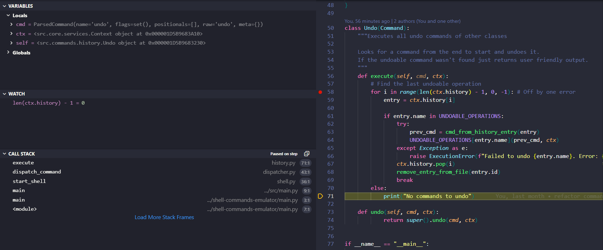

---

## Ошибка 4 - изменение списка во время итерации (пропуск элемента)

**Место:** `misc_utils.py`, `update_history_from_file`

**Симптом:**
При чистке истории одна из записей с `name: ""` остаётся (если их две подряд).

**Воспроизведение:**

1. В `.history.json` сделать 2 подряд записи с `"name": ""` (+ одну нормальную, типа `ls`).
2. `uv run python main.py`

**Отладка:**

1. Breakpoint на `ctx.history.remove(entry)`.  
2. После удаления первого `""` следующий `entry.name` сразу становится `"ls"`, а второй `""` остаётся в списке (элемент пропускается).

**Причина:**
Удаление элементов из списка во время `for` → индексы сдвигаются и следующий элемент пропускается.

**Исправление:**
Заменил на фильтрацию: `ctx.history = [e for e in ctx.history if e.name != ""]`.

**Проверка:**
После исправления оба `""` удаляются из `ctx.history` стабильно.

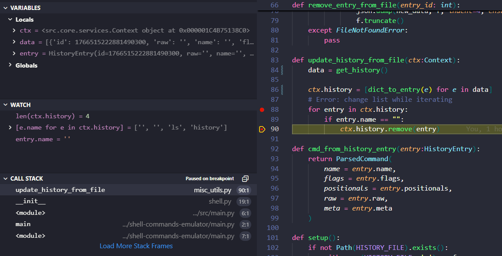

---

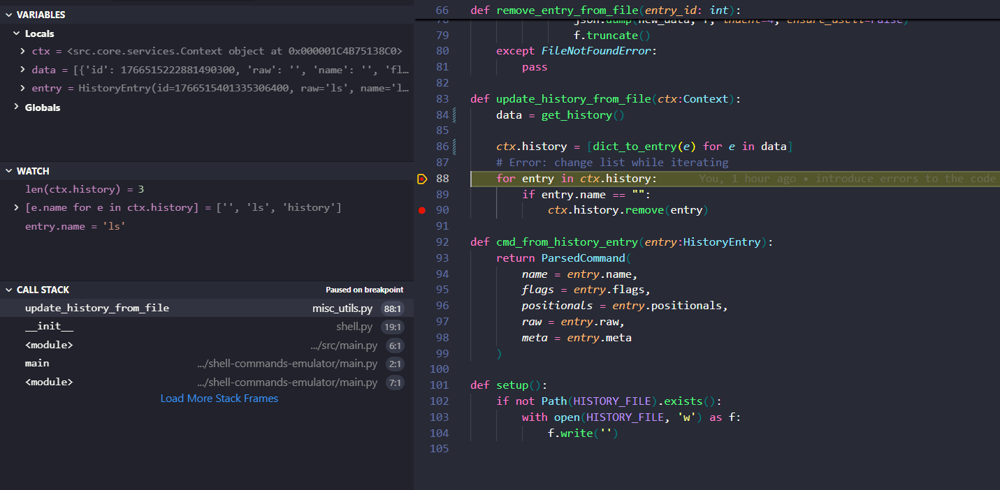

---

## Ошибка 5 - изменяемое значение по умолчанию (общий history)

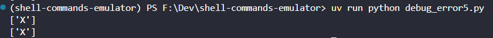

**Место:** `services.py`, `Context.__init__`

**Симптом:**
Два разных `Context()` делят один и тот же `history`: добавление `'X'` в одном видно и во втором.

**Воспроизведение:**

1. Запустить `uv run python -c "from src.core.services import Context; a=Context(); b=Context(); a.history.append('X'); print(a.history); print(b.history)"`

**Отладка:**

1. Breakpoint после `self.history = history`.  
2. В первом и втором вызове `__init__` адрес `history` одинаковый (скрины 5.2 и 5.3).

**Причина:**
Список `[]` в аргументе по умолчанию создаётся один раз и переиспользуется → общий объект на все экземпляры.

**Исправление:**
`history=None`, внутри: `self.history = [] if history is None else history`.

**Проверка:**
После фикса `b.history` остаётся пустым.

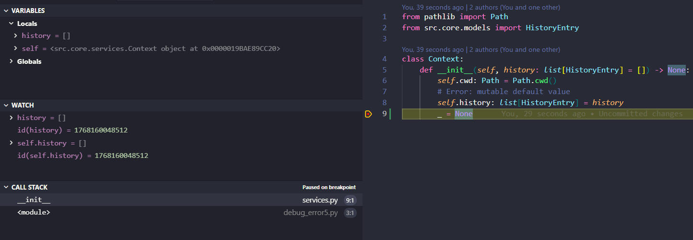
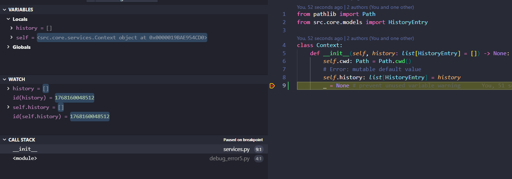
